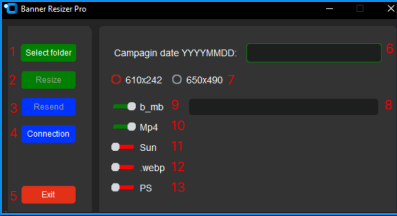
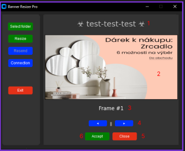
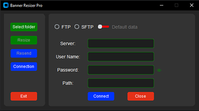

# Banner resizer
An application for resizing, selecting frames, and renaming mp4, png and jpg files used by the team for the “Soon endings” and “Sunday” campaigns. 

## Table of Contents
* [Module in use](#module-in-use)
* [Module for creating an exe file](#module-for-creating-an-exe-file)
* [Setup](#setup)
* [Interface description](#interface-description)
* [Folder structure](#folder-structure)
* [Tips & Tricks](#tips-and-tricks)


### Module in use
- tkinter
- customtkinter
- matplotlib
- opencv-python
- photoshop-python-api
- pillow
- paramiko

### Module for creating an exe file
- pyinstaller

### Setup
- To run this project, install it locally.   
- Install all dependencies from the requirements.txt file using `pip install -r requirements.txt` 
- Generate an exe file using the command `pyinstaller --onefile --clean --paths=, main.py`

### Interface description


    1 - Select the folder containing the files to be resized.
    
    2 - Initiates banner processing.
    
    3 - Sends files back to the server without rescaling them again.
    
    4 - Allows you to check the connection to the server and connect to a server other than the default one.
    
    5 - Closes the application.
    
    6 - Field for entering the campaign name.
    
    7 - Choosing banner sizes after conversion.
    
    8 - Preview path to banner files.
    
    9 - Add the suffix ‘b’ or ‘_mb’ to banner names, enabled by default.
    
    10 - MP4 frame selection: if enabled, it will use the first frame; if disabled, it will open a window for frame selection. 
    
    11 - Change mode for Sunday campaign; if enabled, it enters the selected directory and names files after the directories in which they are located. 
    
    12 - Converts files to .webp format.
    
    13 - Uses Adobe Photoshop to scale banners. 



    1 - Banner name / directory name when the Sunday option is enabled.
    
    2 - Frame preview.
    
    3 - Number of selected frame.
    
    4 - Button to change frame.
    
    5 - Closes the mp4 slider.
    
    6 - Accept frame.

- The view can be managed using dedicated buttons or arrows and the Enter key on the keyboard.


- In this view, we can connect to a server other than the default one to check the connection. If it is correct, all files will be transferred to that server. We can also modify data for default servers, but it will not be saved in memory, and the modifications will disappear when the application is closed. This view is intended for temporary use. 
### Folder structure
```
project/
├── banner_slider/     # mp4 banner slider code          
├── image_processing/  # scripts that clean names, duplicate banners, convert to webp
├── menu/              # scripts displaying interface elements
├── resizingMethod/    # file scaling methods
│   ├── photoshopApi/       # scaling using Adobe Photoshop
│   ├── systemResize/       # scaling using the pillow module 
├── serverData/        # connection to the server and default server data
├── ui/                # application interface
│   ├── ui_elements/        # interface elements such as button labels, etc
│   ├── ui_managers/        # application views
└── README.md
```

## Tips and Tricks

information about where to find the most important functions for managing the application's operation.


### Scaled file dimensions
File path: resizingMethod/paramCheck.py
```
    @property
    def _size_calculated(self) -> list:
        if self.width_height == 650:
            return [650, 490]
        else:
            return [610, 242]

    @property
    def _banner_format_calculated(self) -> str:
        if self.b_mb == 'on':
            if self.width_height == 650:
                return '_mb'
            else:
                return 'b'
        else:
            return ''
```
- To change the default scaling sizes, modify the ScalingParametersCheck class and the values of the radio buttons  in the file. menu/menu_consts.py in the value element.
```
MAIN_MENU_RADIO_BUTTON = [
        {'Name': "610x242", "Text": "610x242", "Value": "610", "Variable": "format_type_var", "Command": "resend_block", 'x': 70, 'y': 80},
        {'Name': "650x490", "Text": "650x490", "Value": "650", "Variable": "format_type_var", "Command": "resend_block", 'x': 160, 'y': 80}]
```

### Server data
File path : serverData/serverDefaultData.py
```
passToFTP = {"hostname": "",
             "username": "",
             "password": "",
             "ftpCatDir": "here add a new folder path",
             "serverName": "Kaczka"}

passToSFTP = {"hostname": "",
              "username": "",
              "password": "",
              "ftpCatDir": "",
              "serverName": ""}

```
- The application allows you to define default data for two FTP and SFTP servers, but the default server selected during file transfer is always FTP. To change the directory to which files are sent, edit the serverDefaultData.py file.

### Number of frames in mp4
File path: resizingMethod/convert_mp4.py
```    
    def extract_one_frame_per_second(self) -> list:
        banner_check: list = list(os.listdir(f"{self.video_path}"))
        banner_filter = [banner for banner in banner_check if banner.endswith('.mp4')]
        video_file = fr"{self.video_path}\{banner_filter[0]}"
        filename = video_file
        vidcap = cv2.VideoCapture(filename)
        fps = vidcap.get(cv2.CAP_PROP_FPS)
        success, image = vidcap.read()
        frame_count = 0

        while success:
            if frame_count % fps == 0:
                rgb_image = cv2.cvtColor(image, cv2.COLOR_BGR2RGB)
                self.keyframes_data.append((frame_count, rgb_image))

            success, image = vidcap.read()
            frame_count += 1

        vidcap.release()
        print(f"Loading complete.  {len(self.keyframes_data)} frames found.")

        return self.keyframes_data
```
- function responsible for extracting 1 frame per second, If you want to change the number of frames loaded per second, modify the condition in the loop. 
```
        while success:
            if frame_count % int(fps/N) == 0:
                rgb_image = cv2.cvtColor(image, cv2.COLOR_BGR2RGB)
                self.keyframes_data.append((frame_count, rgb_image))
```
- replacing ‘fps’ -> ‘int(fps/N)’ where ‘N’ is the expected number of frames per second.

### Conditions for file duplication
File path: image_processing/file_copy.py
```    
        def copy_file(self, data, ext, file_prefix_1: str, file_prefix_2: str, new_file_prefix: str) -> None:
            self.file_path_list = [country.lower() for country in self.file_path_list]
            if f'{file_prefix_1}{data}{ext}.png' in self.file_path_list and f'{file_prefix_2}{data}{ext}.png' not in self.file_path_list:
                shutil.copy(self.file_path + fr'/{file_prefix_1}{data}{ext}.png', self.file_path + fr'/{new_file_prefix}{data}{ext}.png')
                print(f' - added missing {new_file_prefix}{data}{ext}.png file')
    
            elif f'{file_prefix_2}{data}{ext}.png' in self.file_path_list:
                shutil.copy(self.file_path + fr'/{file_prefix_2}{data}{ext}.png', self.file_path + fr'/{new_file_prefix}{data}{ext}.png')
    
            if os.path.exists(self.file_path + fr'/{file_prefix_2}{data}{ext}.png'):
                os.remove(self.file_path + fr'/{file_prefix_2}{data}{ext}.png')
```
- Countries such as 
  - DACH 
  - CHFR/BEFR/FR 
  - NL/BENL 
 - have defined conditions for when their banners are duplicated if they are the same. If you want to change the condition or add another country, you need to modify the above file.


### New elements
All elements such as buttons, entries, radio buttons, etc. are already defined, so you don't need to create them from scratch. Below is an example of how to add new elements using a button as an example.

File path: ui/ui_elements/button.py
```
class Button:
    def __init__(self, text: str, fg_color: str, hover_color: str, command: Callable[[], None], master: object) -> None:
        self.text: str = text
        self.fg_color: str = fg_color
        self.hover_color: str = hover_color
        self.command: Callable[[], None] = command
        self.master: object = master
        self.width: int = 80
        self.height: int = 26
        self.font: tuple = ('Open Sans', 12)
        self.text_color = '#ffffff'

    def add_button(self) -> ctk.CTkButton:
        button = ctk.CTkButton(master=self.master,
                               text=self.text,
                               width=self.width,
                               height=self.height,
                               fg_color=self.fg_color,
                               hover_color=self.hover_color,
                               font=self.font,
                               command=self.command,
                               text_color=self.text_color)
        return button
```

- The Button class containing the definition of this element.


File path: menu/connection_menu.py
``` 
    @staticmethod
    def show_button(options: list[dict], master, command: dict) -> list[dict]:
        buttons: list[dict] = []
        for button in range(len(options)):
            item = Button(text=options[button]['Text'],
                          fg_color=options[button]['fg_color'],
                          hover_color=options[button]['hover_color'],
                          command=command[options[button]['Name']],
                          master=master
                          ).add_button()

            buttons.append({"Name": options[button]['Name'],
                            "Item": item,
                            "Place": item.place(x=options[button]['x'], y=options[button]['y'], anchor='center')})

        return buttons
 ```

- The ConnectionMenu class method used to generate all defined button elements

File path: menu/menu_consts.py

```
@dataclass
class MenuConsts:
    CONNECTION_TEXT_BOX = [{'Name': "pathDate:", 'x': 220, 'y': 210}]

    CONNECTION_SWITCH = [
        {"Name": "defaultDate:", "Text": "Default data", "State": "disabled", "Command": "addDefaulParam",
         "Variable": "switch_var_0", "x": 210, "y": 40}]

    MAIN_MANU_BUTTON = [{'Name': "SelectFolder", 'Text': "Select folder", "fg_color": 'green', 'hover_color': '#34661e',
                         'command': 'get_banner_dir', 'x': 60, 'y': 85},
                        {'Name': "Resize", 'Text': "Resize", "fg_color": 'green', 'hover_color': '#34661e',
                         'command': 'get_banner_dir', 'x': 60, 'y': 125},
                        {'Name': "Resend", 'Text': "Resend", "fg_color": '#0033FF', 'hover_color': '#0000FF',
                         'command': 'get_banner_dir', 'x': 60, 'y': 165},
                        {'Name': "Connection", 'Text': "Connection", "fg_color": '#0033FF', 'hover_color': '#0000FF',
                         'command': 'get_banner_dir', 'x': 60, 'y': 205},
                        {'Name': "Exit", 'Text': "Exit", "fg_color": '#e33118', 'hover_color': '#d11507',
                         'command': 'get_banner_dir', 'x': 60, 'y': 295}]
    MAIN_MENU_SWITCH = [
        {"Name": "BannerType", "Text": "b_mb", "State": "normal", "Variable": "switch_b_mb_var", "Command": "resend_block", "x": 70, "y": 120},
        {"Name": "Mp4:", "Text": "Mp4", "State": "normal", "Variable": "switch_mp4_var", "Command": "resend_block","x": 70, "y": 150},
        {"Name": "Sunday", "Text": "Sun", "State": "normal", "Variable": "switch_sunday_var", "Command": "resend_block","x": 70, "y": 180},
        {"Name": "WebP", "Text": ".webp", "State": "normal", "Variable": "switch_webp_var", "Command": "resend_block", "x": 70, "y": 210},
        {"Name": "PhotoShop:", "Text": "PS", "State": "normal", "Variable": "switch_photoshop_var", "Command": "resend_block", "x": 70, "y": 240},
    ]
```

- The MenuConsts class in which we define button groups 


### Displaying new elements


- To display a new item, you need to add it to the MenuConsts class in format `NEW_ELEMENTS_NAME: list[dict] =[{}, {}, {}]`, as shown above.
- The content of dictionaries depends on the type of element; all required fields can be checked in the file for a given element.

Example from the file ui/ui_managers/main_menu.py
```
self.command_dict: dict = {
            'SelectFolder': lambda: (self.get_banner_dir(), self.update_folder_localization()),
            'Resize': self.run_resize_process,
            'Resend': self.banner_frame,
            'Connection': self.connection_menu,
            'Exit': self.quite_app,

        }

        self.create_widgets()
        self._configure_widget()

    def create_widgets(self) -> None:
        self.main_menu_buttons = ConnectionMenu.show_button(options=MenuConsts.MAIN_MANU_BUTTON,
                                                                            master=self,
                                                                            command=self.command_dict)

    def _configure_widget(self) -> None:
        if self.banner_dir is None:
           self.main_menu_buttons[1]['Item'].configure(state="disabled")
        self.main_menu_buttons[2]['Item'].configure(state="disabled")
```

- The following code will display all button elements defined in the MAIN_MANU_BUTTON constant.

```    
def create_widgets(self) -> None:
        self.main_menu_buttons = ConnectionMenu.show_button(options=MenuConsts.MAIN_MANU_BUTTON,
                                                                            master=self,
                                                                            command=self.command_dict)
```

- You should also define a dictionary with functions that will be loaded into the ‘command’ field.

```
 self.command_dict: dict = {
            'SelectFolder': lambda: (self.get_banner_dir(), self.update_folder_localization()),
            'Resize': self.run_resize_process,
            'Resend': self.banner_frame,
            'Connection': self.connection_menu,
            'Exit': self.quite_app,
        }
```

- Specific configurations of individual buttons are added as shown below. We refer to individual buttons using the order in which they are added in the MAIN_MANU_BUTTON constant.

```
 self.main_menu_buttons[1]['Item'].configure(state="disabled")
```

